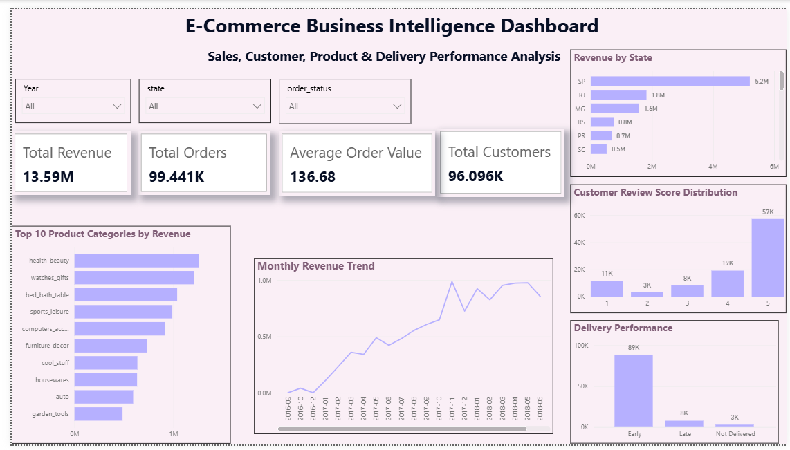

# 🛒 E-Commerce Business Intelligence & Customer Analytics

### 📊 End-to-End Data Analytics Project

An end-to-end **E-Commerce Business Intelligence project** analyzing sales, customers, products, delivery performance, and customer satisfaction using **Python, MySQL, SQL, and Power BI**.

---

## 🚀 Project Overview

This project analyzes the **Brazilian Olist E-Commerce Dataset** to transform raw transactional data into meaningful business insights.

The project follows a complete analytics workflow:

> 🐍 **Python** → 🗄️ **MySQL** → 🔎 **SQL Analysis** → 📊 **Power BI** → 💡 **Business Insights**

The goal is to understand **what is happening in the business, why it is happening, and where improvements can be made.**

---

## 🎯 Business Objectives

- 📈 Analyze overall sales and order performance
- 🛍️ Identify high-performing products and categories
- 👥 Understand customer purchasing behavior
- 🔁 Identify repeat customers
- 🗺️ Analyze regional and state-level performance
- 🚚 Measure delivery performance
- ⭐ Analyze customer review scores
- 🎯 Segment customers using RFM analysis
- 📊 Build an interactive business intelligence dashboard

---

## 🛠️ Tech Stack

| Area | Tools |
|---|---|
| 🐍 Programming | Python |
| 🧹 Data Cleaning | Pandas, NumPy |
| 🗄️ Database | MySQL |
| 🔎 Data Analysis | SQL |
| 📊 Visualization | Power BI |
| 📐 BI & Calculations | DAX |
| 📓 Development | Jupyter Notebook |
| 🌐 Version Control | Git & GitHub |

---

## 📦 Dataset

The project uses the **Brazilian Olist E-Commerce Dataset**, containing approximately 100K orders and information related to:

- 👤 Customers
- 📦 Orders
- 🛒 Order Items
- 🏷️ Products
- 🏪 Sellers
- 💳 Payments
- ⭐ Reviews
- 📍 Geolocation
- 🗂️ Product Categories

> > 📌 **Dataset Note:** The original raw CSV files are not included in this repository. The project uses the Brazilian Olist E-Commerce Dataset for analysis.
---

# 🔄 Project Workflow

## 1️⃣ Data Cleaning & Preparation — Python 🐍

Python was used to prepare the raw datasets for analysis.

### Key tasks:

- 📥 Load multiple CSV datasets
- 🧹 Clean column names
- 📅 Convert date/time columns
- 🚚 Calculate delivery duration
- ⏱️ Calculate delivery delays
- 📆 Create purchase date features
- 🔍 Check missing values
- ♻️ Check duplicate records
- 📊 Prepare analysis-ready datasets

---

## 2️⃣ Database Development — MySQL 🗄️

The cleaned datasets were organized into a relational MySQL database.

### Main tables:

```text
customers
orders
order_items
products
sellers
payments
reviews
category_translation
3️⃣ SQL Business Analysis 🔎

SQL was used to answer important business questions.

📈 Sales Analysis
Monthly revenue
Total orders
Average Order Value
Product revenue
Sales trends
🛍️ Product Analysis
Top products
Top categories
Units sold
Average product price
👥 Customer Analysis
Total customers
Repeat customers
Customer purchase frequency
Top customers
🗺️ Regional Analysis
Revenue by state
Orders by state
Average Order Value by state
🚚 Delivery Analysis
Early deliveries
On-time deliveries
Late deliveries
Average delivery time
Delivery delays
⭐ Customer Satisfaction
Review score distribution
Review score vs delivery performance
Low-rating analysis
🧠 Advanced SQL Analysis

The project also uses advanced SQL techniques:

🔹 CTEs
🔹 Window Functions
🔹 LAG()
🔹 RANK()
🔹 Running Totals
🔹 NTILE()
🔹 RFM Customer Segmentation
👥 RFM Customer Segmentation

RFM analysis was performed to understand customer value and purchasing behavior.

Metric	Meaning
🕐 Recency	How recently the customer purchased
🔁 Frequency	How often the customer purchased
💰 Monetary	How much the customer spent

Customers were segmented into groups such as:

🏆 Champions
💎 Loyal Customers
🌱 New Customers
⚠️ At Risk
💤 Lost Customers
👤 Regular Customers

📊 Power BI Dashboard

The final Power BI dashboard provides an interactive view of the business.

📌 Key KPIs
KPI	Value
💰 Product Revenue	13.59M
🛒 Total Orders	99K+
👥 Total Customers	96K+
💳 Average Order Value	136.68
Dashboard includes:
💰 Revenue KPI
🛒 Order KPI
👥 Customer KPI
💳 Average Order Value
📈 Monthly Revenue Trend
🏆 Top Product Categories
🗺️ Revenue by State
🚚 Delivery Performance
⭐ Customer Review Distribution
🎛️ Interactive Filters
🖼️ Dashboard Preview
<p align="center">  </p>
🔍 Key Business Insights
💰 Sales Performance

The analysis generated approximately 13.59M in product revenue across approximately 99K orders.

👥 Customer Base

The dataset contains approximately 96K unique customers, allowing detailed customer-level analysis.

🛍️ Product Performance

Category and product-level analysis helps identify products contributing strongly to overall revenue and sales volume.

🗺️ Regional Performance

Revenue and order volumes vary significantly across Brazilian states, providing opportunities for regional performance analysis.

🚚 Delivery Performance

Delivery status can be analyzed across Early, On Time, Late, and Not Delivered categories.

⭐ Customer Satisfaction

Review scores provide an additional perspective on customer experience and can be compared with delivery performance.

💼 Business Value

This analysis can support e-commerce businesses in:

📈 Monitoring sales performance
👥 Understanding customer behavior
🎯 Identifying valuable customer segments
🛍️ Optimizing product categories
🗺️ Understanding regional demand
🚚 Improving delivery performance
⭐ Monitoring customer satisfaction
💡 Supporting data-driven decisions

📁 Project Structure
Ecommerce-Business-Intelligence/
│
├── 📂 python/
│   └── 🐍 ecommerce_data_cleaning_analysis.py
│
├── 📂 sql/
│   ├── 🗄️ database_setup.sql
│   ├── 🔎 business_analysis.sql
│   └── 👥 rfm_segmentation.sql
│
├── 📂 screenshots/
│   └── 📊 dashboard.png
│
└── 📄 README.md
🧰 Skills Demonstrated
📊 Data Analytics

Python Pandas NumPy SQL

🗄️ Database

MySQL Relational Data Modeling

📈 Business Intelligence

Power BI DAX Data Visualization

🧠 Analytics

Sales Analysis Customer Analytics RFM Segmentation Delivery Analysis

🔎 SQL

CTEs Joins Window Functions LAG RANK NTILE

🌟 Project Highlights

✅ End-to-end analytics workflow
✅ Relational database design
✅ Advanced SQL analysis
✅ Customer RFM segmentation
✅ Interactive Power BI dashboard
✅ Business-focused insights
✅ Portfolio-ready documentation

👩‍💻 Author
Arpita Tidme

🎓 Electronics & Telecommunication Engineering
📊 Data Analytics & Business Intelligence
